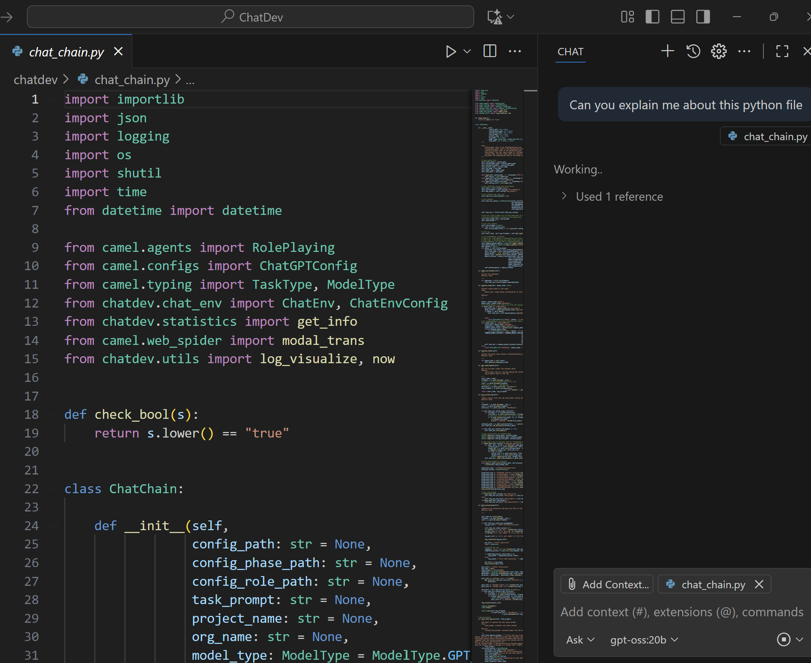

# Running GPT-OSS-20b SLM locally!

## Introduction

I want to use a SLM, **GPT-OSS-20b** from OpenAI so that when I use VS Code. How can I use this locally stored pre-trained LLM instead of GitHub CoPilot?


## Create files and folders

We can run a local **20 B GPT‑OSS** model (or any LLM that runs on your machine) and hook it into VS Code instead of using cloud‑based GitHub Copilot.

The trick is to expose the model as an API that looks like OpenAI’s endpoint, then point a VS Code extension at that local endpoint. Below are two practical ways to do this:

1.  Run the model with a lightweight local inference engine (e.g., Ollama, vLLM, or Hugging‑Face Inference Server).
2.  Create/modify an existing VS Code extension so it talks to your local server.


| Option |  What you need |  Typical RAM / GPU |  Pros | Cons |
|----------|--------------------|--------------|-------|------|
**Ollama**  | ~12 GB VRAM (or 40 GB+ if you want low‑latency) |  Zero‑config, auto‑downloads models, supports  `chat/completions`. |  Not as fast as a fully custom vLLM deployment. |

## Install Olama and use the model

curl -fsSL https://ollama.ai/install.sh | sh

Test whether Olama is running by following command:

http://localhost:11434

ollama pull gpt-oss:20b

[Reference : OpenAI's gpt-oss:20b model](https://ollama.com/library/gpt-oss)

ollama serve

If server cannot be started

sudo lsof -i :11434

sudo systemctl stop ollama

### Generating a response

curl http://localhost:11434/api/generate -H "Content-Type: application/json" -d '{
  "model": "gpt-oss:20b",
  "prompt": "Explain recursion in Python."
}'

### Chatting with the model in Ollama

curl -X POST http://localhost:11434/api/chat -H "Content-Type: application/json" -d '{
  "model": "gpt-oss:20b",
  "stream": false,
  "messages": [{ "role": "user", "content": "Explain recursion in Python" }]
}'

### Formatting and adding additional switches

The chat to Ollama is below:

curl -X POST http://localhost:11434/api/chat -H "Content-Type: application/json" -d '{ 
   "model": "gpt-oss:20b", 
   "stream": false, 
   "messages": [{ "role": "user", "content": "Explain recursion in Python" }] 
}'

The return from gpt-oss:20b can be below:

{"model":"gpt-oss:20b","created_at":"2025-09-25T11:07:20.163412055Z","message":{"role":"assistant","content":"## Recursion in Python – A Quick \u0026 Easy Primer\n\n\u003e **Recursion** = A function that calls itself.\n\nIt’s one of the classic ways to solve problems that naturally break down into smaller, similar sub‑problems (e.g., factorials, tree traversals,   sorting algorithms, combinatorics).\n\nBelow is a “cookbook” style walk‑through that covers:\n\n| Section | What you’ll  learn |\n|---------|-------------------|\n| 1️⃣  What is recursion? | Concept \u0026 why it works |\n| 2️⃣  Anatomy of a  recursive function | Base case + recursive case |\n| 3️⃣  Classic examples | Factorial, Fibonacci, factorial via tail   recursion |\n| 4️⃣  The call stack | How Python keeps track of calls |\n| 5️⃣  Depth limits \u0026 pitfalls | Recursion depth, stack overflow |\n| 6️⃣  Optimizations \u0026 alternatives | Tail‑call, memoization, `functools.lru_cache` |\n| 7️⃣  Debugging \u0026 testing | How to spot infinite recursion |\n| 8️⃣  Recursion vs Iteration | When to use which |\n\n\u003e **TL;DR**  \n\u003e A recursive function must have:  \n\u003e *A “base case”* (no more recursion) and  \n\u003e *A “recursive case”* (calls itself with a simpler input).  \n\u003e If you forget either, you’ll hit a stack overflow or infinite loop.\n\n---\n\n## 1️⃣  What is Recursion?\n\nRecursion is a technique where a function solves a problem by solving *the same problem on smaller data* until it reaches a situation that’s trivial to answer (the base case).  \nIt’s like a “divide‑and‑conquer” approach:\n\n```\nsolve(problem)\n   if problem is trivial:\n        return simple answer\n   else:\n        split problem into smaller sub‑problems\n        solve each sub‑problem recursively\n        combine the sub‑solutions\n```\n\nPython’s function call stack automatically keeps the “intermediate” work. Each recursive call pushes a frame (function call) onto the stack; when the function returns, that frame is popped.\n\n---\n\n## 2️⃣  Anatomy of a Recursive Function\n\n```python\ndef recursive_function(input):\n    # ---- Base case (stop condition) ----\n    if \u003ctrivial condition\u003e:\n        return \u003csimple answer\u003e\n\n    # ---- Recursive case ----\n    # Prepare a simpler input for the next call\n    simpler_input = \u003ctransform input\u003e\n    result_of_smaller = recursive_function(simpler_input)\n\n    # ---- Combine results ----\n    return \u003ccombine result_of_smaller with something\u003e\n```\n\n**Key Rules**\n\n1. **Base case must be reachable.**  \n   Without it, you’ll hit a stack overflow (RecursionError).\n\n2. **Progress toward the base case.**  \n   Each recursive call must make *strict* progress, otherwise you’ll loop forever.\n\n3. **Return the result** – The last line usually returns something that is the combination of the smaller result and some new data.\n\n---\n\n## 3️⃣  Classic Examples\n\n### 3.1  Factorial\n\n```python\ndef factorial(n: int) -\u003e int:\n    if n \u003c= 1:                 # Base case\n        return 1\n    return n * factorial(n-1)   # Recursive case\n```\n\n| n | factorial(n) |\n|---|--------------|\n| 5 | 5 × 4 × 3 × 2 × 1 = 120 |\n\n### 3.2  Fibonacci (naïve)\n\n```python\ndef fib(n: int) -\u003e int:\n    if n \u003c= 1:\n        return n\n    return fib(n-1) + fib(n-2)\n```\n\nThis version is *exponential* (O(2ⁿ)) because it recomputes the same sub‑problems repeatedly.\n\n### 3.3  Tail‑Recursive Factorial\n\nA *tail‑call* is when the recursive call is the very last thing the function does. CPython does **not** optimise tail calls, but it still demonstrates the idea.\n\n```python\ndef tail_fact(n: int, acc: int = 1) -\u003e int:\n    if n \u003c= 1:\n        return acc\n    return tail_fact(n-1, acc * n)\n```\n\n### 3.4  Sum of a List\n\n```python\ndef sum_list(lst):\n    if not lst:                     # Base case: empty list\n        return 0\n    return lst[0] + sum_list(lst[1:])\n```\n\n### 3.5  Binary Tree In‑order Traversal\n\n```python\nclass Node:\n    def __init__(self, val, left=None, right=None):\n        self.val, self.left, self.right = val, left, right\n\ndef inorder(node):\n    if node is None:\n        return []\n    return inorder(node.left) + [node.val] + inorder(node.right)\n```\n\n---\n\n## 4️⃣  The Call Stack\n\nWhen `factorial(5)` runs:\n\n```\nfactorial(5)\n    factorial(4)\n        factorial(3)\n            factorial(2)\n                factorial(1)   \u003c-- base case\n                return 1\n            return 2 * 1\n        return 3 * 2\n    return 4 * 6\nreturn 5 * 24 = 120\n```\n\nEach call waits for the inner call to finish; the result is “propagated back” when the stack unwinds.\n\n---\n\n## 5️⃣  Depth Limits \u0026 Pitfalls\n\n- **RecursionError**: Python limits the depth of recursion (default 1000).  \n  ```python\n  import sys\n  sys.getrecursionlimit()   # 1000 by default\n  ```\n\n- **Tail‑call optimisation** is *not* implemented in CPython; so deep recursion can still blow the stack even if the algorithm is tail‑recursive.\n\n- **Stack Overflow**: Occurs if you forget a base case or don’t progress towards it.  \n  ```python\n  def bad(n):\n      return bad(n)      # infinite recursion → RecursionError\n  ```\n\n### How to increase the limit (use with caution)\n\n```python\nimport sys\nsys.setrecursionlimit(2000)\n```\n\nBut increasing the limit too high can crash the interpreter or your machine.\n\n---\n\n## 6️⃣  Optimizations \u0026 Alternatives\n\n### 6.1  Memoisation (caching sub‑results)\n\n```python\nfrom functools import lru_cache\n\n@lru_cache(maxsize=None)\ndef fib(n):\n    if n \u003c= 1:\n        return n\n    return fib(n-1) + fib(n-2)\n```\n\nThis turns the Fibonacci function into *O(n)* time, because each `fib(k)` is computed only once.\n\n### 6.2  Iterative Alternatives\n\nRecursion can often be replaced by loops:\n\n```python\ndef iterative_factorial(n):\n    result = 1\n    for i in range(2, n+1):\n        result *= i\n    return result\n```\n\nIterative solutions avoid stack overhead and are usually faster in CPython.\n\n### 6.3  PyPy’s Tail‑Call Optimization\n\nIf you run your code with [PyPy](https://www.pypy.org/), tail‑call optimisation is *available*, meaning:\n\n```python\ndef tail_fact(n, acc=1):\n    if n \u003c= 1:\n        return acc\n    return tail_fact(n-1, acc * n)  # PyPy will optimise this\n```\n\n---\n\n## 7️⃣  Debugging \u0026 Testing\n\n1. **Print the stack depth**  \n   ```python\n   import sys\n   def debug_fact(n):\n       print(\"depth\", sys._getframe().f_back.f_lineno)\n       if n \u003c= 1: return 1\n       return n * debug_fact(n-1)\n   ```\n\n2. **Check for infinite recursion**  \n   If you hit a `RecursionError`, double‑check:\n   - Does the base case really hit?\n   - Are you mutating the input towards the base case?\n\n3. **Unit tests**  \n   ```python\n   import unittest\n\n   class TestRecursion(unittest.TestCase):\n       def test_factorial(self):\n           self.assertEqual(factorial(5), 120)\n           self.assertEqual(factorial(0), 1)\n   ```\n\n4. **Use `warnings`**  \n   ```python\n   import warnings\n   def warn_on_depth(n, max_depth=1000):\n       if n \u003e max_depth:\n           warnings.warn(\"Depth might be too high\")\n       ...\n   ```\n\n---\n\n## 8️⃣  Recursion vs Iteration – When to Use Which?\n\n| Factor | Recursion | Iteration |\n|--------|-----------|-----------|\n| **Readability** | Often clearer for tree/graph problems | Can be clearer for linear loops |\n| **Memory** | O(n) stack space | O(1) extra space |\n| **Performance** | Usually slower in CPython | Faster, less overhead |\n| **Language support** | Some languages optimise tail calls | None needed |\n| **Problem nature** | Natural for hierarchical data | Natural for flat sequences |\n\n\u003e **Bottom line:** Use recursion when the problem is inherently recursive and the data size is modest. Prefer iteration when you need maximum performance or when recursion depth is large.\n\n---\n\n### Quick Recap (One‑Page Summary)\n\n```text\nRecursion:\n- A function calls itself.\n- Must have a base case (no recursion) AND a recursive case that progresses toward it.\n- Python keeps a call stack; each call pushes a frame.\n- Beware of RecursionError (default depth 1000).\n- Use memoisation (`@lru_cache`) for overlapping sub‑problems.\n- Tail‑call optimisation isn’t in CPython (but PyPy supports it).\n- When in doubt, check if an iterative version is simpler or faster.\n```\n\nHappy coding! If you have a specific problem you’d like to solve recursively, just let me know and we can walk through it together.","thinking":"We need to explain recursion in Python. Provide definition, why used, example, base case, recursion case, stack, pitfalls, tail recursion, Python's recursion depth limit, etc. Also show examples: factorial, fibonacci, factorial via tail recursion, tree traversal, etc. Also mention recursion vs iteration, overhead, call stack, memory consumption. Provide code examples. Show how to debug recursion, printing stack trace. Show Python's sys.setrecursionlimit. Provide tail recursion optimization is not done by CPython, but by PyPy. Provide some more advanced topics: memoization, lru_cache. Provide usage in functional programming.\n\nThe user wants an explanation, not necessarily advanced. So produce a comprehensive but approachable explanation, with code snippets. Use indentation. Show step-by-step.\n\nLet's craft a response.\n\n"},"done":true,"done_reason":"stop","total_duration":429201160077,"load_duration":103176337,"prompt_eval_count":71,"prompt_eval


[Reference : Ollama API](https://github.com/ollama/ollama)

Go to VS Code, on the lower right corner click "Manage Models" then type Ollama and then you should see gpt-oss:20b, select it.
Then select that model for coding. The screen shot below shows how it can be done:

## How to set up VS Code to use SLM (gpt-oss:20b in Ollama)





## RAG

RAG or Retrieval-Augmented Generation, is an AI framework that enhances large language models (LLMs) by connecting them to external knowledge bases to provide more accurate, current, and domain-specific information. 

Extending this SLM work to RAG can be read in the following document [RAG How-To](rag/Rag.md)


## Workflow diagrams

Render UML diagrams using [Mermaid](https://mermaidjs.github.io/). For example, sequence diagram below will show workflow:

```mermaid
sequenceDiagram
Copilot->> Curl: Prompt
Curl-->>Olama:  curl -X POST http://localhost:11434/api/chat/completions \ -H "Content-Type: application/json" \ -d '{ "model": "gpt-oss-20b", "messages": [{"role":"user","content":"Explain recursion in Python."}] }'
GPT-OSS-20b--x Copilot:  GPT response to prompt "recursion in Python"

Note left of Olama: You should see a JSON response that looks just like OpenAI’s API.
